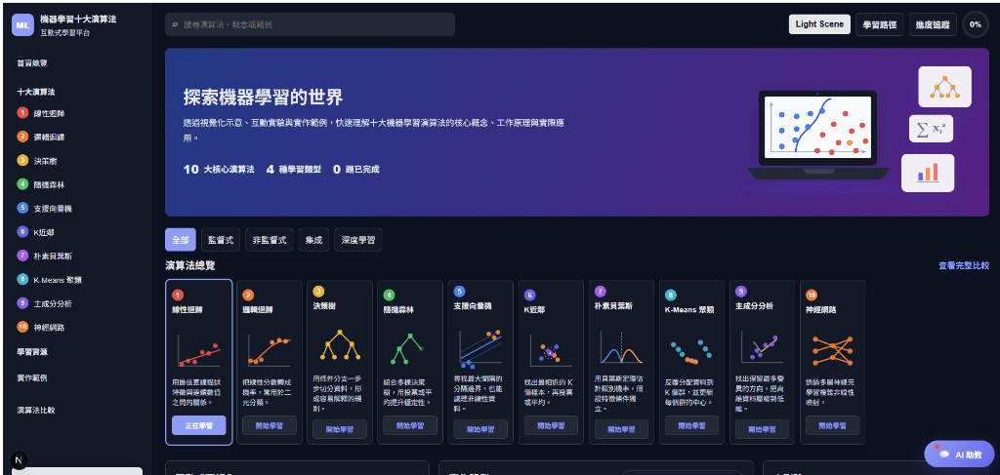

# ML Algorithm Learning

> Demo Link: https://ml-algorithm-learning.onrender.com/




互動式機器學習演算法學習網站。透過視覺化示意、互動實驗與實作範例，快速理解十大機器學習演算法的核心概念、工作原理與實際應用。

## 功能特色

- **十大演算法學習卡片**：搜尋、分類篩選（監督式、非監督式、集成、深度學習）
- **互動式視覺化**：SVG 動畫（每個演算法 5 幀），含圖例說明與核心數學公式
- **小測驗系統**：每個演算法 3 題（易→中→難），附解題說明，進度存入 localStorage，可重置
- **程式碼實作範例 + 真實執行**：10 個演算法的 scikit-learn / TensorFlow 程式碼，可調超參數（如 K 值、樹深、神經元數）並即時執行，顯示真實 Accuracy / F1 / Silhouette 等指標與執行時間
- **推薦學習路徑**：入門 → 中階 → 進階排序導引
- **演算法關係圖**：SVG 互動圖顯示演算法演進脈絡（分類變體、集成擴展、單層類比），節點可點擊跳轉
- **深度演算法頁面**：每個演算法有獨立 URL（`/algorithms/[id]`），含完整視覺化、測驗、程式碼與深度解析，支援分享與收藏
- **新手導覽**：首次訪問顯示 3 步驟引導 Modal，localStorage 記錄已讀狀態
- **進度追蹤面板**：顯示 N/10 演算法測驗完成狀況，支援一鍵重置
- **AI 機器學習助教**：WebSocket 逐字串流，支援 Gemini / Groq / OpenRouter / OpenAI 自動切換
- **線性迴歸模擬實驗室**：調整斜率、截距、噪聲參數，Python 即時計算並繪製迴歸圖，標示 Top-10 離群點
- **骨架屏載入體驗**：首次訪問時頁面立即渲染佈局，演算法卡片與三欄面板以 shimmer 動畫佔位，資料到位後平滑替換，無閃爍感
- **Render 冷啟動 UX**：後端暖機時顯示友善提示，自動重試，不白畫面

## 專案結構

```text
.
├── backend/
│   ├── main.py                  # FastAPI 主程式（API + WebSocket + ML 計算）
│   └── requirements.txt         # Python 依賴
├── frontend/
│   ├── package.json
│   ├── .env.example
│   ├── components/
│   │   ├── AIChatbot.tsx            # AI 助教聊天室（WebSocket 串流）
│   │   ├── AlgorithmRelationshipMap.jsx  # 演算法關係 SVG 圖（可點擊節點）
│   │   ├── CodePanel.jsx            # 程式碼實作範例面板
│   │   ├── DetailModal.jsx          # 演算法完整說明 Modal
│   │   ├── HeroIllustration.jsx     # Hero 區塊插圖
│   │   ├── LinearRegressionLab.jsx  # 線性迴歸模擬實驗室
│   │   ├── MiniChart.jsx            # SVG 動畫圖表元件（10 種演算法）
│   │   ├── OnboardingModal.jsx      # 首次訪問新手導覽（3 步驟）
│   │   ├── QuizPanel.jsx            # 小測驗面板（3 題制）
│   │   └── VisualPanel.jsx          # 互動視覺化面板（圖例 + 公式）
│   ├── lib/
│   │   ├── algorithmData.js     # 圖表類型、圖例、公式、程式碼範例
│   │   └── algorithmReport.js   # 建模流程指引
│   └── pages/
│       ├── index.js             # 主頁面
│       └── algorithms/
│           └── [id].js          # 個別演算法頁面
├── docs/
│   ├── log.md                   # 開發指令與 Git 紀錄
│   ├── todo.md                  # 待辦清單
│   └── 工作報告.md               # 各階段工作報告
├── sources/
│   └── demo_screenshot.png
├── render.yaml
└── README.md
```

## 後端 API

| 端點 | 方法 | 說明 |
| :--- | :--- | :--- |
| `/api/algorithms` | GET | 取得所有 10 個演算法的完整資料 |
| `/api/algorithms/{id}` | GET | 取得單一演算法詳細資料 |
| `/api/run-code` | POST | 依 `algorithm_id` 與超參數 `params` 執行真實 scikit-learn 模型，回傳指標與執行時間 |
| `/api/run-linear-regression` | POST | 對使用者提供的 (x, y) 點組執行線性迴歸 |
| `/api/simulate-linear-regression` | POST | 依 n, a, b, σ² 參數生成模擬資料並執行迴歸，回傳離群點 |
| `/ws/ai-chat` | WebSocket | AI 助教即時串流問答 |

## 使用技術

- **Frontend**：Next.js 15、React 18、styled-jsx
- **Backend**：FastAPI、Uvicorn、Gunicorn、Pydantic
- **ML**：scikit-learn（LinearRegression）、NumPy
- **AI 助教**：Google Gemini / Groq Llama 3 / OpenRouter / OpenAI GPT-4o-mini（自動故障轉移）
- **即時通訊**：HTML5 WebSocket API
- **部署**：Render（免費方案，前後端各一個 Web Service）
- **版本控制**：Git、GitHub

## 本機執行

### 1. 啟動後端

```bash
cd backend
python -m venv venv
venv\Scripts\activate
pip install -r requirements.txt
uvicorn main:app --reload --host 0.0.0.0 --port 8000
```

API 會在 `http://localhost:8000` 啟動。

### 2. 啟動前端

```bash
cd frontend
npm install
npm run dev
```

前端會在 `http://localhost:3000` 啟動。

如果後端不是跑在 `http://localhost:8000`，請建立 `frontend/.env.local`：

```bash
NEXT_PUBLIC_API_BASE_URL=https://your-api-domain.example.com
```

### 3. AI 助教金鑰設定

在 `backend/.env` 填入以下金鑰（至少一個，系統自動切換）：

```env
GEMINI_API_KEY=你的_Gemini_API_Key       # 主力（Google AI Studio 免費）
GROQ_API_KEY=你的_Groq_API_Key           # 備援 A（Groq Console 免費）
OPENROUTER_API_KEY=你的_OpenRouter_Key   # 備援 B（OpenRouter 免費額度）
OPENAI_API_KEY=你的_OpenAI_API_Key       # 備援 C（付費）
```

若所有金鑰皆未設定，系統自動降級為模擬教學模式（Mock Mode），展示不中斷。

---

## Render 部署

此專案為 monorepo，需在 Render 建立兩個 Web Service。

### 後端 Web Service

- Runtime: `Python`
- Root Directory: `backend`
- Build Command: `pip install -r requirements.txt`
- Start Command: `gunicorn main:app --workers 2 --worker-class uvicorn.workers.UvicornWorker --bind 0.0.0.0:$PORT`
- Environment Variables（在 Render Dashboard 填入）：
  - `ALLOWED_ORIGINS`：前端網域（如 `https://ml-algorithm-learning.onrender.com`），限制 CORS 來源
  - `GEMINI_API_KEY`、`GROQ_API_KEY` 等（依需求設定）

### 前端 Web Service

- Runtime: `Node`
- Root Directory: `frontend`
- Build Command: `npm install && npm run build`
- Start Command: `npm start`
- Environment Variables（在 Render Dashboard 填入，`render.yaml` 已宣告欄位）：

```bash
NEXT_PUBLIC_API_BASE_URL=https://your-backend.onrender.com
NEXT_PUBLIC_WS_URL=wss://your-backend.onrender.com/ws/ai-chat
```

### 建議部署順序

1. 先部署後端，複製後端 URL
2. 建立前端 Web Service，填入 `NEXT_PUBLIC_API_BASE_URL` 與 `NEXT_PUBLIC_WS_URL`
3. 部署前端

> **冷啟動說明**：Render 免費方案後端閒置 15 分鐘後暫停。首次訪問時前端會顯示「後端服務喚醒中，約需 30~60 秒」，並每 10 秒自動重試，無需手動重新整理。

---

## 開發紀錄

- 📄 [開發指令與 Git 紀錄](docs/log.md)
- 📄 [各階段工作報告](docs/工作報告.md)
- 📄 [待辦清單](docs/todo.md)

## GitHub 注意事項

- 不要上傳 `node_modules`、`.next`、Python 虛擬環境、`__pycache__` 或本機 log
- 保留 `frontend/package-lock.json` 確保部署環境版本一致
